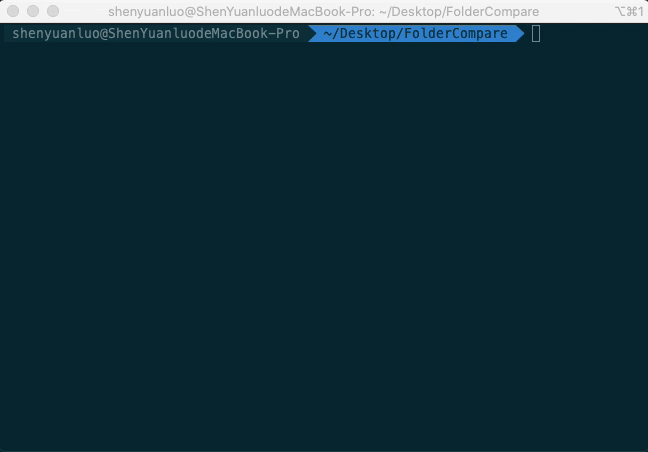

# UnityAutoMerge

> 关于 `iOS` 原生项目集成 `Unity` 项目的处理，网上有很多教程，这里不讨论这个。这里想要说的是 **如何自动化处理 `Unity` 代码更新至 `iOS` 工程中**。

在 **常规** 的 `Unity` 代码更新时，都要经过以下步骤：

1. `Unity` 代码编译生成对应的 `Unity_iOS` 工程
2. 把 `Unity_iOS` 工程更新的代码（一般都是：**Libraries**、**Classes**、**Data** 这三个目录的文件数据更新）合并到原生`iOS` 工程
3. 原生的 `iOS` 工程添加相应的接口处理。。。

这其中第二步的 **合并** 步骤，其实包含了很多相似重复性的工作，每次都是代码文件的 **曾、删、改** ；在常规的使用 `BeyondCompare` 可以满足当前需求。但是如果频繁需要更新 `Unity` 代码，那就不能保证每次手工比对代码已经添加文件不会出错，而且还加重了工作负担，因此决定做一个 **脚本** 脚本来自动化处理。

## Unity 代码更新处理流程

继续细化 **合并** 步骤，又可以分为以下：

- 新增 Unity 文件
- 删除 Unity 文件
- 修改 Unity 文件

对于这几个操作需求，`shell`就可以满足这要求，大体思路如下：

> 遍历 **Unity** 工程文件和 **iOS** 工程文件（主要是 `Libraries`、`Data`、文件夹以及 `Classes `目录下的`Native`子文件夹 ），对于 *新增*、*修改* 的文件，可以直接 `cp`，同时记录新加的 **文件/文件夹**，对于删除的文件，可以直接 `rm`，同时记录删除的 **文件/文件夹** 即可。

于是就写了一个脚本如下：

### 查找 Unity 新增文件(shell)

```shell
# 递归检查‘新增’文件
# param1: 源文件夹；param2：目的文件夹
function rec_check_add_file()
{
    dir_list=$(ls $1)   # 获取所有(可视)文件
    for name in ${dir_list[*]}  # 遍历文件路径数组
    do
        # 资源文件夹过滤判断
        if [ "$1" == "$source_dir" ] ; then  # 顶层文件夹过滤
            if [ "$name" != "Classes" ] && [ "$name" != "Data" ] && [ "$name" != "Libraries" ]; then
                continue
            fi
        fi

        if [ "$1" == "$source_dir/Classes" ]; then  # Classes/Native 文件夹过滤
            if [ "$name" != "Native" ]; then
                continue
            fi
        fi

        if [ -f $1/$name ]; then    # 如果路径 ‘$1/$name’ 是文件
            if [ ! -f $2/$name ]; then  # 如果路径 ‘$2/$name’ 文件不存在
                add_file_array[${#add_file_array[@]}]=$2/$name    # 记录‘新增’文件
            fi
            echo "拷贝文件：$1/$name"
            cp $1/$name $2/$name     # 拷贝到目标路径

        elif [ -d $1/$name ]; then  # 如果 $1/$name 是文件夹
            if [ ! -d $2/$name ]; then  # 如果 $2/$name 文件夹不存在
                add_foloder_array[${#add_foloder_array[@]}]=$2/$name    # 记录‘新增’文件夹
                echo "创建文件夹：$2/$name"
                mkdir -p $2/$name   # 创建文件夹
            fi
            # 递归处理
            rec_check_add_file $1/$name $2/$name
        fi
    done
}
```

### 查找 Unity 删除文件(shell)

```shell
# 递归检查‘删除’文件
# param1: 源文件夹；param2：目的文件夹；
function rec_check_del_file()
{
    dir_list=$(ls $1)   # 获取所有(可视)文件

    for name in ${dir_list[*]}  # 遍历文件路径数组
    do
        if [ -f $1/$name ]; then    # 如果路径 ‘$1/$name’ 是文件
            if [ ! -f $2/$name ]; then  # 如果路径 ‘$2/$name’ 文件不存在
                del_file_array[${#del_file_array[@]}]=$2/$name    # 记录‘删除’文件
#                echo "删除文件：$1/$name"
                rm $1/$name     # 移除源文件
            fi
        elif [ -d $1/$name ]; then  # 如果 $1/$name 是文件夹
            if [ ! -d $2/$name ]; then  # 如果 $2/$name 文件夹不存在
                recursive_del_file $1/$name  # 则递归删除文件夹下的文件
            else   # 如果存在
                # 递归处理
                rec_check_del_file $1/$name $2/$name
            fi
        fi
    done
}
```



至此，Unity工程 和 iOS 工程 **物理** 文件/文件夹已处理完毕，接下来的就是往 iOS 工程中 **添加/删除 文件/文件夹的依赖关系** 了。这时发现 shell 无法直接处理（主要是 `***.xcodeproj` 文件的处理自己还没摸透逻辑关系），后来 google 了一下发现，原来已有伟人走在了前面（我就说嘛，这么*大众* 的需求，怎么会没有成熟的解决方案），已经有大佬用 **`Ruby`** 写了一个库 [Xcodeproj](https://github.com/CocoaPods/Xcodeproj)，专门用于处理 Xcode 工程配置文件的。

## iOS 工程文件的依赖添加

有了 **Xcodeproj** ，命令行管理 Xcode 文件依赖关系就异常的方便了；但是之前 **物理** 文件关系处理用的是 `shell`，而依赖关系处理用的是 `Ruby`，两个不同的脚本语言。虽然二者均可以相互混用，但是对于不是很熟悉脚本的我来说，就显得比较困难了，干脆直接用 `Ruby` 再写一套物理文件处理的脚本。

### 查找 Unity 新增文件(Ruby)

```ruby
# 递归检查‘新增’文件
def rec_check_add_file(src_file_path, dest_file_path)
    Dir.foreach(src_file_path) do |file_name|
        # 系统‘隐藏’文件过滤
        if file_name == "." or file_name == ".." or file_name == ".DS_Store"
            next
        end
        # 资源文件夹过滤
        if src_file_path == @source_dir_path    # 顶层文件夹过滤
            if file_name != "Classes" and file_name != "Data" and file_name != "Libraries"
                next
            end
        end
        # Classes/Native 文件夹过滤
        if src_file_path == @source_dir_path + "/Classes"
            if file_name != "Native"
                next
            end
        end

        if File.directory? (src_file_path + "/" + file_name)  # 如果是‘文件夹’
            unless File.exist? (dest_file_path + "/" + file_name)   # 如果文件夹不存在
                @add_foloder_array.push(dest_file_path + "/" + file_name)   # 记录‘新增’文件夹
                Dir.mkdir(dest_file_path + "/" + file_name) # 创建文件夹
            end
            # 递归处理
            rec_check_add_file(src_file_path + "/" + file_name, dest_file_path + "/" + file_name)
        elsif File.file? (src_file_path + "/" + file_name)    # 如果是‘文件’
            unless File.exist? (dest_file_path + "/" + file_name) # 文件不存在
                @add_file_array.push(dest_file_path + "/" + file_name)  # 记录‘新增’文件
            end
            FileUtils.cp(src_file_path + "/" + file_name, dest_file_path + "/" + file_name) # 拷贝到目标路径
        end
    end
end
```

### 查找 Unity 删除文件(Ruby)

```ruby
# 递归检查‘删除’文件
def rec_check_del_file(src_file_path, dest_file_path)
    Dir.foreach(src_file_path) do |file_name|
        # 系统‘隐藏’文件过滤
        if file_name == "." or file_name == ".." or file_name == ".DS_Store"
            next
        end

        if File.directory? (src_file_path + "/" + file_name)  # 如果是‘文件夹’
            if File.exist? (dest_file_path + "/" + file_name)   # 如果文件夹存在
                # 递归处理
                rec_check_del_file(src_file_path + "/" + file_name, dest_file_path + "/" + file_name)
            else
                rec_delete_file(src_file_path + "/" + file_name)   # 则递归删除文件夹下的文件
            end
        elsif File.file? (src_file_path + "/" + file_name)    # 如果是‘文件’
            unless File.exist? (dest_file_path + "/" + file_name) # 文件不存在
                @del_file_array.push(src_file_path + "/" + file_name)  # 记录‘删除’文件
                File.delete(src_file_path + "/" + file_name)   # 删除源文件
            end
        end
    end
end
```

### 添加 Unity 文件依赖(Ruby)

```ruby
# 添加文件依赖
def add_reference(target, project, to_group, file_path, need_mrc)
    if to_group and File::exist?(file_path)
        if file_path != "." and file_path != ".." and file_path != ".DS_Store"
            pb_gen_file_path = file_path
            if to_group.find_file_by_path(pb_gen_file_path)
                puts pb_gen_file_path + " reference exist"
            else
                file_reference = to_group.new_reference(pb_gen_file_path)
                if need_mrc and file_path.include?("pbobjc.m")
                    target.add_file_references([file_reference],'-fno-objc-arc')
                else
                    target.add_file_references([file_reference])
                end
            end
        end
        project.save
    end
end
```

### 删除 Unity 文件依赖(Ruby)

```ruby
# 移除文件依赖
def rmv_reference(target, project, from_group, file_path)
    if from_group and file_path
        from_group.files.each do |file_ref|
            if file_ref.real_path.to_s == file_path
                file_ref.remove_from_project
                target.source_build_phase.remove_file_reference(file_ref)
                target.resources_build_phase.remove_file_reference(file_ref)
                target.headers_build_phase.remove_file_reference(file_ref)
                break
            end
        end
        project.save
    end
end
```

这样， Unity 代码更新自动化处理就完成了！

> 期间我发现：对于物理文件的处理，`ruby` 比 `shell` 快了好多，同样的工程代码文件，`shell` 处理需要 4~5 秒左右，而 `ruby` 仅需要 1~2 秒。我印象中 `shell` 命令应该是很快的，怎么 `ruby` 还比 shell 快？如果有知道的大佬，还望告知，谢了！

### 补充

添加/删除文件的依赖关系，需要安装 Ruby 库 **Xcodeproj** ，如果没有安装的，则需安装，安装命令如下

> sudo gem install xcodeproj

## 参考

1. [懒人福利：用脚本来修改Xcode工程](http://blog.wtlucky.com/blog/2016/10/10/use-script-to-modify-xcode-project/)
2. [使用代码为 Xcode 工程添加文件](https://draveness.me/bei-xcodeproj-keng-de-zhe-ji-tian/)
3. [ruby操作项目.xcodeproj](https://juejin.im/post/5bfe6ec2e51d4534b03e8871)
